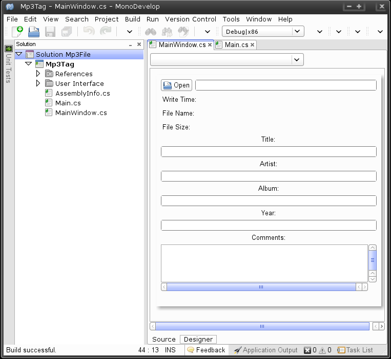
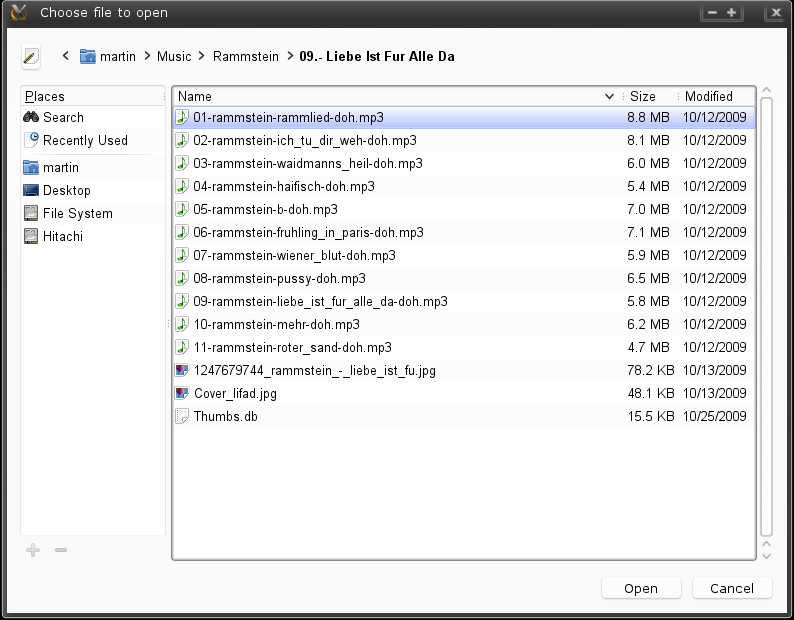
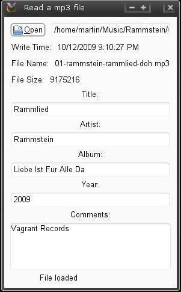

# usando flujos de entrada y salida con GTK# .NET

Todos los programas de computadora hacen uso de dispositivos de entrada y salida, los más clásicos para estos fines son el teclado (entrada estándar) y la consola salida (salida estándar). .NET hace una abstracción de cada uno de estos dispositivos con el modelo de flujos (bajo el (concepto) de flujo), haciendo la analogía como si se tratase de una corriente de agua, solo que para el caso de las aplicaciones .NET se trata de corrientes de bytes. En resumen la comunicación entre .NET y  el hardware de la computadora se realiza mediante el concepto de flujos. La clase base para el tratamiento de estos flujos es la clase <a href="http://msdn.microsoft.com/en-us/library/system.io.stream.aspx">Stream</a>, de la cuál derivan los flujos necesarios para la comunicación de los programas hacia el respaldo (persistencia) o en términos de .NET el Backing Store. .NET  a diferencia de Java utiliza la misma clase para los flujos de entrada como para los de salida. A continuación la lista de los flujos básicos de entrada/salida:

<ul>
<li>FileStream: hacia archivos de disco</li>
<li>MemoryStream: hacia estructuras de memoria</li>
<li>NetworkStream: hacia conexiones de red</li>
</ul>

A continuación, mostramos como ejemplo un proyecto GTK#  realizado en <a href="http://http://monodevelop.com/">MonoDevelop</a> cuyo diseño de pantalla se muestra en la siguiente imagen: 

 Ahora se muestra el listado que utiliza algunos de estos conceptos para leer un archivo binario <i>.mp3</i> y obtener la información correspondiente al los datos del <a href="http://en.wikipedia.org/wiki/ID3">ID3 tag</a> en estos archivos.  

Primeramente en el código utilizamos las clases <tt>FileStream</tt>, <tt>BinaryReader</tt>, <tt>FileInfo</tt> del ensamblado <tt>System.IO</tt>, el cuál utilizamos en el encabezado:

<pre>
	using System.IO;
</pre>

Con las siguientes lineas utilizamos la clase <tt>FileInfo</tt> para obtener algunas propiedades acerca del archivo, propiedades que mostramos en las etiquetas de la interfaz.

<pre>
	file = new FileInfo(fc.Filename);
	int size = Convert.ToInt32(file.Length);
	lbFileName.Text = file.Name;
	lbWriteTime.Text = file.LastWriteTime.ToString();
	lbFileSize.Text = size.ToString();
</pre>

Ahora con el siguiente código implementamos toda la funcionalidad para la lectura de un archivo binario, utilizando un <tt>FileStream</tt> hacia un archivo creando un flujo de bytes como entrada que dirigimos hacia un <a href="http://msdn.microsoft.com/en-us/library/system.io.binaryreader.aspx">BinaryReader</a> (Lector binario) con el cuál utilizando el metódo <a href="http://msdn.microsoft.com/en-us/library/system.io.binaryreader.readbytes.aspx">ReadBytes</a> para leer un arreglo de 128 bytes que son los bytes que contienen los datos del ID3 tag. 

<pre>
	FileStream fis = new FileStream(file.FullName,FileMode.Open,
	FileAccess.Read,FileShare.Read);
	using(BinaryReader reader = new BinaryReader(fis))
	{
		int offset = size - 128;
		reader.BaseStream.Position = offset;
		b = reader.ReadBytes(128);
	}
</pre> 

Una vez obtenido el arreglo de bytes,lo convertimos a caracteres, para que utilicemos la longitud y la posición correcta de cada dato según el estándar ID3, esto se logra con el siguiente código:

<pre>
	char[] c = new char[128];
	for(int i = 0;i < b.Length;i++)
	c[i] = (char)b[i];
	string strTag = new string(c,0,3);
	if(strTag.Equals("TAG"))
	{
		PutMsg("File loaded");
		txtTitle.Text = new string(c,3,30);
		txtArtist.Text = new string(c,33,30);
		txtAlbum.Text = new string(c,63,30);
		txtYear.Text = new string(c,93,4);
		txtComments.Buffer.Text = new string(c,97,30);
	}
</pre>

Una vez compilada la aplicación, al ejecutarse utilizaremos el botón 
<i>"open"</i> para seleccionar un archivo <tt>mp3</tt> del sistema de archivos.

Una vez que el archivo ha sido cargado se mostrará la información correspondiente:

